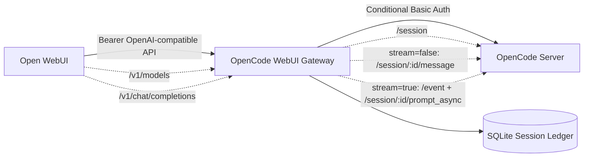

# OpenCode WebUI Gateway

OpenAI-compatible gateway that lets Open WebUI talk to OpenCode through a narrow `/v1` API surface.

## Current Scope

- `GET /health`
- `GET /v1/models`
- `POST /v1/chat/completions`
- Bearer authentication from Open WebUI to the gateway
- Conditional Basic Auth from the gateway to OpenCode
- Static public model routing
- SQLite-backed session ledger
- `stream=false` synchronous OpenCode message forwarding
- `stream=true` real OpenCode async/event streaming

No Phase 3 or Phase 4 features are implemented.

## Tested OpenCode Version

Phase 2 streaming was verified against OpenCode `1.15.13`.

The Phase 2 streaming path requires OpenCode support for:

- `GET /event`
- `POST /session/:id/prompt_async`
- `GET /session/:id/message` for optional final usage lookup only
- Target-session events with `properties.sessionID`
- Text deltas from `message.part.delta`
- Completion signal from `session.idle`

## Architecture



## Model Routing

| Public model ID | Internal OpenCode agent |
|---|---|
| `adina-analysis` | `plan` |
| `adina-execution` | `build` |

The gateway does not expose raw OpenCode agents and does not support aliases, dynamic routing, prompt routing, or fallback between models.

## Chat Paths

### stream=false Synchronous Path

`stream=false` uses synchronous OpenCode message forwarding:

1. Resolve or create the ledger row for `(X-OpenWebUI-User-Id, X-OpenWebUI-Chat-Id, body.model)`.
2. Send only the latest Open WebUI user message to OpenCode with `POST /session/:id/message`.
3. Extract returned text parts.
4. Return one OpenAI-compatible `chat.completion` JSON response.

This path is the Phase 1 behavior and remains supported.

### stream=true Real Streaming Path

`stream=true` uses real OpenCode async/event streaming:

1. Resolve or create the ledger row.
2. Acquire an in-flight lock for the OpenCode session ID.
3. Subscribe to `GET /event` before prompting.
4. Wait for `server.connected`.
5. Send the latest prompt with `POST /session/:id/prompt_async`.
6. Map target-session OpenCode events into OpenAI-compatible `chat.completion.chunk` SSE chunks.
7. Complete on target-session `session.idle` after target-session activity has been observed.
8. Emit `data: [DONE]`.

The gateway does not wait for a full synchronous OpenCode response before emitting streaming content. Events from other OpenCode sessions are ignored. Raw OpenCode events are not exposed to Open WebUI.

The old synchronous SSE shim is not Phase 2. It has been removed from the `stream=true` path; fake chunking from a completed synchronous response is not used.

## Streaming Fallback Behavior

There is no fake streaming fallback for `stream=true`.

If OpenCode streaming is unavailable, malformed, unauthorized, or times out before headers are sent, the gateway returns a sanitized OpenAI-style error. If the stream has already started, the gateway emits a sanitized markdown error delta, a stop chunk, and `data: [DONE]`.

Use `stream=false` if the deployed OpenCode version does not support the Phase 2 streaming endpoints.

## Streaming Known Limitations

- Text-only streaming. OpenAI tools/function-calling are not implemented.
- No raw OpenCode event passthrough.
- No raw tool output, shell output, patches, or secrets are exposed.
- No dynamic model routing or raw OpenCode agent exposure.
- No MCP or ACP integration.
- No Phase 3 multi-tenant OpenCode container spawning.
- No Phase 4 metrics, tracing, idle cleanup, or explicit cancel endpoint.
- Usage is emitted only when `stream_options.include_usage == true` and real OpenCode token metadata is available from final message fetch.
- `GET /session/:id/message` is not used for normal `stream=true`; it is only used for optional real usage lookup.
- One active stream is allowed per OpenCode session ID; concurrent streams for the same session return `session_busy`.

## Known-Good Host OpenCode Mode

Terminal A:

```bash
cd /home/siryoos/opencode-docker/projects/agent-with-memory
opencode serve
```

Expected OpenCode output:

```text
Warning: OPENCODE_SERVER_PASSWORD is not set; server is unsecured.
opencode server listening on http://127.0.0.1:4096
```

Terminal B:

```bash
cd ~/Documents/Adin/Adina/opencode-webui-gateway

export GATEWAY_API_KEY=dev-secret
export OPENCODE_BASE_URL=http://127.0.0.1:4096
export DATABASE_PATH=./gateway.sqlite3
export ALLOW_UNSECURED_OPENCODE=true
export REQUIRE_AUTH_ON_HEALTH=false
export REQUEST_TIMEOUT_SECONDS=120
export STREAM_TIMEOUT_SECONDS=120
unset OPENCODE_SERVER_USERNAME
unset OPENCODE_SERVER_PASSWORD

go run ./cmd/gateway
```

Expected gateway warning:

```text
OpenCode is unsecured; this is only allowed for local development
```

Unsecured OpenCode mode is local development only. Production should configure `OPENCODE_SERVER_PASSWORD` and keep OpenCode off public networks.

## Configuration

Required environment variables:

- `GATEWAY_API_KEY`
- `OPENCODE_BASE_URL`
- `DATABASE_PATH`
- `ALLOW_UNSECURED_OPENCODE`
- `REQUIRE_AUTH_ON_HEALTH`
- `REQUEST_TIMEOUT_SECONDS`

Optional environment variables:

- `OPENCODE_SERVER_USERNAME`, default `opencode`
- `OPENCODE_SERVER_PASSWORD`
- `GATEWAY_API_KEY_FILE`
- `OPENCODE_SERVER_USERNAME_FILE`
- `OPENCODE_SERVER_PASSWORD_FILE`
- `STREAM_TIMEOUT_SECONDS`, default `120`

File-secret variants take precedence over direct environment variables.

## Validation Commands

```bash
go test ./...
go vet ./...
go build ./cmd/gateway
```

Health:

```bash
curl -sS http://127.0.0.1:8080/health
```

Models:

```bash
curl -sS http://127.0.0.1:8080/v1/models \
  -H 'Authorization: Bearer dev-secret'
```

Chat, `stream=false`:

```bash
curl -sS http://127.0.0.1:8080/v1/chat/completions \
  -H 'Authorization: Bearer dev-secret' \
  -H 'Content-Type: application/json' \
  -H 'X-OpenWebUI-User-Id: local-user' \
  -H 'X-OpenWebUI-Chat-Id: local-chat' \
  -d '{"model":"adina-analysis","stream":false,"messages":[{"role":"user","content":"Say hello from OpenCode."}]}'
```

Chat, `stream=true`:

```bash
curl -N http://127.0.0.1:8080/v1/chat/completions \
  -H 'Authorization: Bearer dev-secret' \
  -H 'Content-Type: application/json' \
  -H 'X-OpenWebUI-User-Id: local-user' \
  -H 'X-OpenWebUI-Chat-Id: local-chat' \
  -d '{"model":"adina-analysis","stream":true,"messages":[{"role":"user","content":"Say hello from OpenCode using streaming."}]}'
```

Phase 1 smoke script:

```bash
GATEWAY_API_KEY=dev-secret DATABASE_PATH=./gateway.sqlite3 scripts/phase1-smoke.sh
```

Phase 2 OpenCode streaming discovery:

```bash
OPENCODE_BASE_URL=http://127.0.0.1:4096 \
ALLOW_UNSECURED_OPENCODE=true \
scripts/phase2-discover-streaming.sh
```

The discovery script verifies live OpenCode streaming primitives directly and writes `docs/discovery/phase2-streaming-live-verification.md`. If this script fails, Phase 2 must be treated as blocked for that OpenCode runtime.

Phase 2 gateway smoke script:

```bash
GATEWAY_BASE_URL=http://127.0.0.1:8080 \
GATEWAY_API_KEY=dev-secret \
DATABASE_PATH=./gateway.sqlite3 \
scripts/phase2-smoke.sh
```

Supported Phase 2 smoke environment variables:

- `GATEWAY_BASE_URL`, default `http://127.0.0.1:8080`
- `GATEWAY_API_KEY`, default `dev-secret` for local development only
- `TEST_USER_ID`, default generated per run
- `TEST_CHAT_ID`, default generated per run
- `STREAM_SMOKE_TIMEOUT_SECONDS`, default `120`

The smoke script also reads `DATABASE_PATH` to verify ledger reuse and per-model ledger rows.

## Open WebUI Setup

In Open WebUI, add an OpenAI-compatible connection:

- Base URL from Docker Open WebUI to host gateway: `http://host.docker.internal:8080/v1`
- API key: the value of `GATEWAY_API_KEY`
- Enable forwarded user info headers with `ENABLE_FORWARD_USER_INFO_HEADERS=true`

Both `X-OpenWebUI-User-Id` and `X-OpenWebUI-Chat-Id` are required. The gateway does not use `body.user`, `single-user-local`, `default-chat`, or prompt content as fallback identity.

## Session Ledger

SQLite stores the durable mapping:

```text
(X-OpenWebUI-User-Id, X-OpenWebUI-Chat-Id, body.model) -> OpenCode session id
```

The same user/chat/model reuses a session across gateway restarts when `DATABASE_PATH` points to the same SQLite file. The same user/chat with a different model creates a separate OpenCode session.

## Dockerized OpenCode Status

The official `ghcr.io/anomalyco/opencode:latest` image started successfully in local debugging, but this workspace required `python3` and OpenCode execution failed with:

```text
Executable not found in $PATH: "python3"
```

Dockerized OpenCode needs a project-compatible runtime image. For this workspace, Python is required. `Dockerfile.opencode-python` extends the OpenCode image and installs:

- `python3`
- `pip`
- `bash`
- `git`
- `curl`
- `ca-certificates`

Dockerized OpenCode acceptance is not complete until direct Dockerized OpenCode execution returns text parts.

## Troubleshooting

- `streaming stopped before completion`: check that OpenCode supports `GET /event` and `POST /session/:id/prompt_async`.
- `session_busy`: another active stream is already using the same OpenCode session ID.
- `missing X-OpenWebUI-User-Id`: enable Open WebUI forwarded user info headers.
- `missing X-OpenWebUI-Chat-Id`: enable Open WebUI forwarded user info headers.
- `opencode_no_text_content`: OpenCode returned no text parts and no execution error.
- `opencode_execution_error`: OpenCode returned `info.error`; check OpenCode logs without exposing secrets or full prompt bodies.
- Dockerized OpenCode missing `python3`: use a project-compatible image such as one built from `Dockerfile.opencode-python`.
- Stale `gateway.sqlite3` rows: stop the gateway, inspect or remove the local development SQLite DB, then restart. Do not delete production ledgers blindly.

## Security Notes

- Host OpenCode unsecured mode is local development only.
- Production should protect OpenCode with `OPENCODE_SERVER_PASSWORD`.
- OpenCode credentials must not be exposed to Open WebUI.
- Upstream Open WebUI Bearer tokens are never forwarded to OpenCode.
- Forwarded Open WebUI headers are routing metadata, not authentication.
- The gateway does not claim multi-user OpenCode workspace isolation.
- Secrets, Authorization headers, full prompts, raw shell output, patches, and internal paths must not be logged or committed.

## Limitations

- No MCP or ACP.
- No dynamic model discovery or raw OpenCode agent exposure.
- No fallback identity.
- No provider/model override.
- No OpenAI tools/function-calling.
- No multi-tenant OpenCode container spawning or per-user workspace isolation.
- No Phase 4 operational telemetry features.
