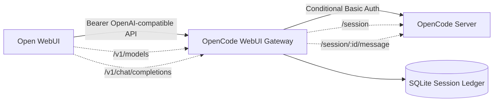

# OpenCode WebUI Gateway

OpenAI-compatible gateway that lets Open WebUI talk to OpenCode through a narrow `/v1` API surface.

## Phase 1 Scope

- `GET /health`
- `GET /v1/models`
- `POST /v1/chat/completions`
- Bearer authentication from Open WebUI to the gateway
- Conditional Basic Auth from the gateway to OpenCode
- Static model routing
- SQLite-backed session ledger
- Synchronous text-only OpenCode message forwarding
- Synchronous SSE compatibility shim for Open WebUI `stream=true`

The SSE shim is not real OpenCode streaming. It waits for the synchronous OpenCode response, then emits OpenAI-compatible `chat.completion.chunk` events. It does not use OpenCode `/event`, `/global/event`, or `prompt_async`.

## Architecture



## Model Routing

| Public model ID | Internal OpenCode agent |
|---|---|
| `adina-analysis` | `plan` |
| `adina-execution` | `build` |

The gateway does not expose raw OpenCode agents and does not support aliases, dynamic routing, prompt routing, or fallback between models.

## Known-Good Host OpenCode Mode

Terminal A:

```bash
cd /home/siryoos/opencode-docker/projects/agent-with-memory
opencode serve
```

Expected OpenCode output:

```text
Warning: OPENCODE_SERVER_PASSWORD is not set; server is unsecured.
opencode server listening on http://127.0.0.1:4096
```

Terminal B:

```bash
cd ~/Documents/Adin/Adina/opencode-webui-gateway

export GATEWAY_API_KEY=dev-secret
export OPENCODE_BASE_URL=http://127.0.0.1:4096
export DATABASE_PATH=./gateway.sqlite3
export ALLOW_UNSECURED_OPENCODE=true
export REQUIRE_AUTH_ON_HEALTH=false
export REQUEST_TIMEOUT_SECONDS=120
unset OPENCODE_SERVER_USERNAME
unset OPENCODE_SERVER_PASSWORD

go run ./cmd/gateway
```

Expected gateway warning:

```text
OpenCode is unsecured; this is only allowed for local development
```

Unsecured OpenCode mode is local development only. Production should configure `OPENCODE_SERVER_PASSWORD` and keep OpenCode off public networks.

## Configuration

Required environment variables:

- `GATEWAY_API_KEY`
- `OPENCODE_BASE_URL`
- `DATABASE_PATH`
- `ALLOW_UNSECURED_OPENCODE`
- `REQUIRE_AUTH_ON_HEALTH`
- `REQUEST_TIMEOUT_SECONDS`

Optional environment variables:

- `OPENCODE_SERVER_USERNAME`, default `opencode`
- `OPENCODE_SERVER_PASSWORD`
- `GATEWAY_API_KEY_FILE`
- `OPENCODE_SERVER_USERNAME_FILE`
- `OPENCODE_SERVER_PASSWORD_FILE`

File-secret variants take precedence over direct environment variables.

## Validation Commands

```bash
go test ./...
go vet ./...
go build ./cmd/gateway
go run ./cmd/gateway
docker compose up --build
```

Health:

```bash
curl -sS http://127.0.0.1:8080/health
```

Models:

```bash
curl -sS http://127.0.0.1:8080/v1/models \
  -H 'Authorization: Bearer dev-secret'
```

Chat, `stream=false`:

```bash
curl -sS http://127.0.0.1:8080/v1/chat/completions \
  -H 'Authorization: Bearer dev-secret' \
  -H 'Content-Type: application/json' \
  -H 'X-OpenWebUI-User-Id: local-user' \
  -H 'X-OpenWebUI-Chat-Id: local-chat' \
  -d '{"model":"adina-analysis","stream":false,"messages":[{"role":"user","content":"Say hello from OpenCode."}]}'
```

Chat, `stream=true` SSE shim:

```bash
curl -N http://127.0.0.1:8080/v1/chat/completions \
  -H 'Authorization: Bearer dev-secret' \
  -H 'Content-Type: application/json' \
  -H 'X-OpenWebUI-User-Id: local-user' \
  -H 'X-OpenWebUI-Chat-Id: local-chat' \
  -d '{"model":"adina-analysis","stream":true,"messages":[{"role":"user","content":"Say hello from OpenCode."}]}'
```

Smoke script:

```bash
GATEWAY_API_KEY=dev-secret DATABASE_PATH=./gateway.sqlite3 scripts/phase1-smoke.sh
```

## Open WebUI Setup

In Open WebUI, add an OpenAI-compatible connection:

- Base URL from Docker Open WebUI to host gateway: `http://host.docker.internal:8080/v1`
- API key: the value of `GATEWAY_API_KEY`
- Enable forwarded user info headers with `ENABLE_FORWARD_USER_INFO_HEADERS=true`

Phase 1 requires both `X-OpenWebUI-User-Id` and `X-OpenWebUI-Chat-Id`. It does not use `body.user`, `single-user-local`, `default-chat`, or prompt content as fallback identity.

## Session Ledger

SQLite stores the durable mapping:

```text
(X-OpenWebUI-User-Id, X-OpenWebUI-Chat-Id, body.model) -> OpenCode session id
```

The same user/chat/model reuses a session across gateway restarts when `DATABASE_PATH` points to the same SQLite file. The same user/chat with a different model creates a separate OpenCode session.

## Dockerized OpenCode Status

The official `ghcr.io/anomalyco/opencode:latest` image started successfully in local debugging, but this workspace required `python3` and OpenCode execution failed with:

```text
Executable not found in $PATH: "python3"
```

Dockerized OpenCode needs a project-compatible runtime image. For this workspace, Python is required. `Dockerfile.opencode-python` extends the OpenCode image and installs:

- `python3`
- `pip`
- `bash`
- `git`
- `curl`
- `ca-certificates`

Dockerized OpenCode acceptance is not complete until a direct Dockerized `POST /session/:id/message` returns text parts.

## Troubleshooting

- `streaming is not supported in Phase 1`: restart the gateway with the Phase 1 finalization build; `stream=true` should now return SSE shim chunks.
- `missing X-OpenWebUI-User-Id`: enable Open WebUI forwarded user info headers.
- `missing X-OpenWebUI-Chat-Id`: enable Open WebUI forwarded user info headers.
- `opencode_no_text_content`: OpenCode returned no text parts and no execution error.
- `opencode_execution_error`: OpenCode returned `info.error`; check OpenCode logs without exposing secrets or full prompt bodies.
- Dockerized OpenCode missing `python3`: use a project-compatible image such as one built from `Dockerfile.opencode-python`.
- Stale `gateway.sqlite3` rows: stop the gateway, inspect or remove the local development SQLite DB, then restart. Do not delete production ledgers blindly.

## Security Notes

- Host OpenCode unsecured mode is local development only.
- Production should protect OpenCode with `OPENCODE_SERVER_PASSWORD`.
- OpenCode credentials must not be exposed to Open WebUI.
- Forwarded Open WebUI headers are routing metadata, not authentication.
- The gateway does not claim multi-user OpenCode workspace isolation in Phase 1.
- Secrets and Authorization headers must not be logged or committed.

## Limitations

- No true OpenCode streaming.
- No OpenCode `/event`, `/global/event`, or `prompt_async` use.
- No MCP or ACP.
- No dynamic model discovery or raw OpenCode agent exposure.
- No fallback identity.
- No provider/model override.
- No cancellation.
- No multi-tenant OpenCode container spawning or per-user workspace isolation.
