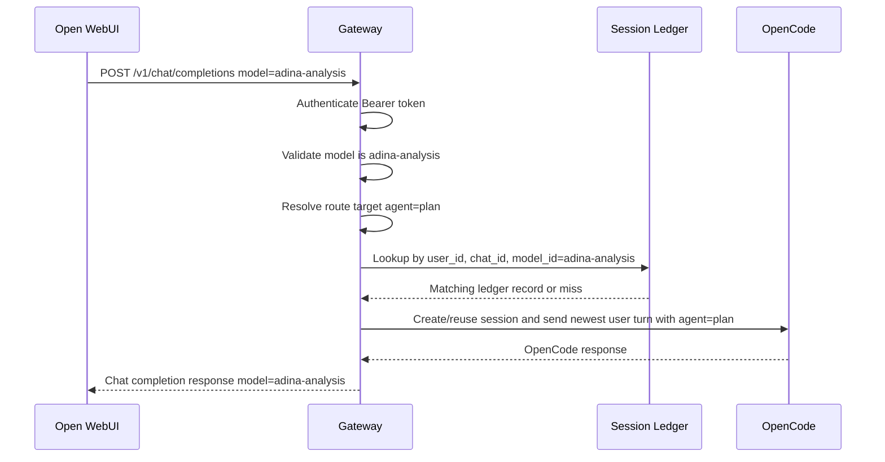
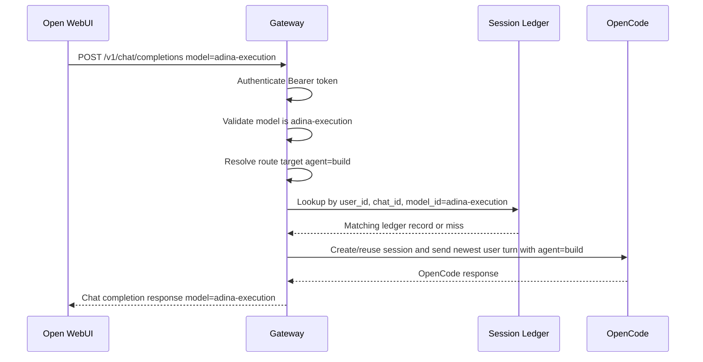
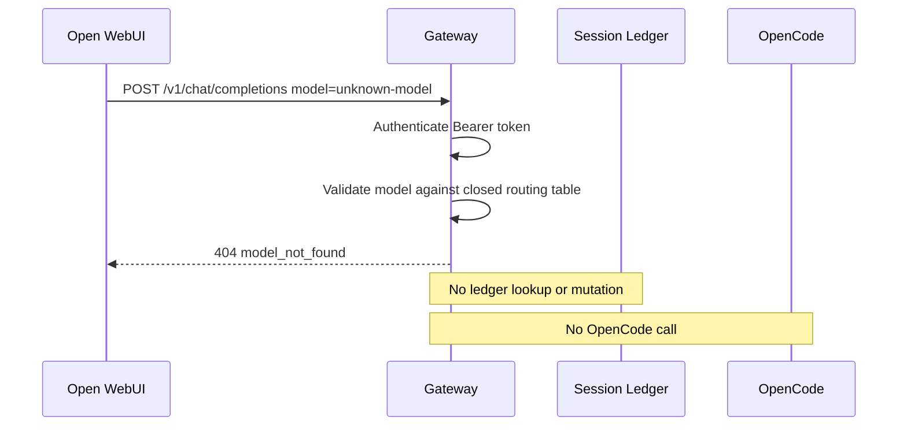

# Model Routing Design

- **Document:** `docs/design/model-routing.md`
- **Status:** Proposed
- **Date:** 2026-06-01
- **Owner role:** Backend Architect
- **Scope:** Static model-to-agent routing for the OpenCode Gateway.
- **Implementation code:** Out of scope.

## 1. Purpose

This document defines the gateway-owned model routing contract between Open WebUI and OpenCode.

Open WebUI selects a public model ID through the OpenAI-compatible API surface. The gateway must translate that public model ID into one approved OpenCode agent name before session lookup or message dispatch.

The routing contract is intentionally small and static:

| Open WebUI public model | OpenCode agent | Capability intent |
|---|---|---|
| `adina-analysis` | `plan` | Planning, analysis, explanation, read-oriented work. |
| `adina-execution` | `build` | Implementation-oriented work through the configured OpenCode build agent. |

There are exactly two public models. The gateway must not expose raw OpenCode agents, infer routes dynamically, load plugins, or route based on prompt content.

## 2. Non-goals

- No implementation code.
- No dynamic routing.
- No plugin architecture.
- No automatic exposure of all OpenCode agents returned by `GET /agent`.
- No prompt-based model selection.
- No user-configurable model-to-agent mapping at request time.
- No OpenAI Assistants API, Responses API, MCP, ACP, or tool-plugin routing.
- No authorization policy engine beyond validating that the requested model is one of the two approved public model IDs.
- No claim that model routing alone provides multi-user isolation.

## 3. Source constraints

This design is constrained by the current roadmap and design artifacts:

| Constraint | Design consequence |
|---|---|
| Phase 1 requires hardcoded model mapping with one analysis model and one execution model. | The gateway exposes exactly `adina-analysis` and `adina-execution`. |
| Open WebUI consumes the gateway through `/v1/models` and `/v1/chat/completions`. | Model IDs must be Open WebUI-facing public identifiers. |
| OpenCode exposes agents through its own server API, but exact `Agent` fields require verification. | The gateway must not blindly publish raw OpenCode agent lists. |
| The Session Ledger key includes `model_id`. | Model validation must happen before ledger lookup/creation. |
| OpenCode message requests include an `agent?` field, but exact downstream schema requires live `/doc` verification. | This document defines logical routing only, not the final JSON request body. |
| Authentication occurs before routing. | An unauthenticated caller must not learn routing behavior through downstream calls. |

## 4. Public model catalog

The gateway model catalog is closed and consists of exactly two entries.

| Field | `adina-analysis` | `adina-execution` |
|---|---|---|
| Public model ID | `adina-analysis` | `adina-execution` |
| OpenCode agent | `plan` | `build` |
| Public visibility | Exposed by `GET /v1/models` | Exposed by `GET /v1/models` |
| Chat completion support | Supported | Supported |
| Streaming support | Not supported in Phase 1 | Not supported in Phase 1 |
| Ledger partitioning | Included in `(user_id, chat_id, model_id)` | Included in `(user_id, chat_id, model_id)` |
| Route mutability | Static | Static |

### 4.1 Required `/v1/models` behavior

`GET /v1/models` must return exactly these two public IDs:

1. `adina-analysis`
2. `adina-execution`

The endpoint must not include:

- `plan`
- `build`
- any other OpenCode agent name
- disabled OpenCode agents
- provider/model override targets
- dynamically discovered agents
- plugin-provided models

The public model ID is the stable API contract. OpenCode agent names are internal gateway routing targets.

### 4.2 Required chat routing behavior

For `POST /v1/chat/completions`, the gateway must route only by `body.model`.

| `body.model` | Routing result |
|---|---|
| `adina-analysis` | Route to OpenCode agent `plan`. |
| `adina-execution` | Route to OpenCode agent `build`. |
| Any other value | Reject as unsupported. Do not call OpenCode. |
| Missing value | Reject as invalid request. Do not call OpenCode. |
| Non-string value | Reject as invalid request. Do not call OpenCode. |

No other input may influence the OpenCode agent route.

## 5. Routing logic

### 5.1 Routing order

The gateway must apply routing in this order:

1. Authenticate the Open WebUI request with the configured Bearer token.
2. Parse and validate the JSON request body for `POST /v1/chat/completions`.
3. Extract `body.model`.
4. Validate that `body.model` is a string.
5. Resolve `body.model` through the closed static routing table.
6. If no route exists, reject before ledger lookup and before any OpenCode call.
7. Use the public `model_id` as part of the Session Ledger composite key.
8. Resolve or create the OpenCode session for `(user_id, chat_id, model_id)`.
9. Forward the newest routable user turn to the resolved OpenCode session using the mapped OpenCode agent.
10. Return the response under the original public model ID, not the internal OpenCode agent name.

### 5.2 Static routing table

| Public model ID | Internal route target | OpenCode message agent |
|---|---|---|
| `adina-analysis` | Analysis route | `plan` |
| `adina-execution` | Execution route | `build` |

The table is closed. Adding a third row is a contract change and violates this document unless this design is explicitly superseded.

### 5.3 Route resolution rules

| Rule | Requirement |
|---|---|
| Exact match | Model IDs must match exactly. |
| Case sensitivity | Model IDs are case-sensitive. `Adina-Analysis` is unsupported. |
| Whitespace | Leading/trailing whitespace is invalid. Do not trim and accept silently. |
| Aliases | No aliases are supported. |
| Prefix routing | Forbidden. `adina-*` matching is not allowed. |
| Prompt inspection | Forbidden. Route must not depend on message content. |
| User role inspection | Forbidden for routing. User role may be future authorization input only if separately designed. |
| Header-based routing | Forbidden. Forwarded Open WebUI headers partition sessions, not model routes. |
| Agent fallback | Forbidden. Unknown models must not fall back to `plan`, `build`, or a default OpenCode agent. |

### 5.4 Session Ledger interaction

The public model ID, not the internal OpenCode agent name, is stored as `model_id` in the Session Ledger key.

```text
(user_id, chat_id, model_id) -> opencode_session_id
```

Required behavior:

| Scenario | Required ledger behavior |
|---|---|
| Same user, same chat, `adina-analysis` | Reuse the `adina-analysis` ledger row and its OpenCode session. |
| Same user, same chat, `adina-execution` | Use a different ledger row from `adina-analysis`. |
| Same user, same chat, model switch from analysis to execution | Do not reuse the analysis session for execution. |
| Unsupported model | Do not read, create, or mutate a ledger row. |
| Missing model | Do not read, create, or mutate a ledger row. |

This prevents read-oriented and execution-oriented agent state from being mixed inside one OpenCode session.

### 5.5 Downstream OpenCode interaction

After route resolution, the gateway sends the mapped OpenCode agent as the logical downstream agent target:

| Public model | Downstream OpenCode agent intent |
|---|---|
| `adina-analysis` | Use `plan` as the OpenCode agent. |
| `adina-execution` | Use `build` as the OpenCode agent. |

The exact OpenCode request JSON field shape is not defined here because the OpenCode message request schema still requires live `/doc` verification. The logical requirement is stable: the chosen public model maps to exactly one OpenCode agent.

## 6. Validation

### 6.1 Model catalog validation

At startup or readiness validation, the gateway should verify that its two configured downstream agent names are available in OpenCode after the exact `GET /agent` schema has been verified.

| Validation | Behavior |
|---|---|
| `plan` is available | `adina-analysis` may be exposed. |
| `build` is available | `adina-execution` may be exposed. |
| `plan` is missing | Gateway readiness should fail or `GET /v1/models` should fail in strict mode. Do not silently remap. |
| `build` is missing | Gateway readiness should fail or `GET /v1/models` should fail in strict mode. Do not silently remap. |
| `GET /agent` schema is unknown | Do not use raw discovery for automatic exposure. Treat as implementation blocker for strict validation. |

This validation is not dynamic routing. It only verifies that the two static target agents exist.

### 6.2 Chat request validation

| Validation rule | Failure behavior |
|---|---|
| `model` is required. | Return `400 invalid_request_error` with code `missing_required_parameter`. |
| `model` must be a string. | Return `400 invalid_request_error` with code `invalid_type`. |
| `model` must equal `adina-analysis` or `adina-execution`. | Return `404 invalid_request_error` with code `model_not_found`. |
| `messages` must be present and valid according to the OpenAI compatibility design. | Return the appropriate request validation error before OpenCode routing. |
| `stream: true` is unsupported in Phase 1. | Return `400 invalid_request_error` with code `unsupported_parameter`. |
| OpenAI `tools`, `tool_choice`, plugin-like fields, or external tool routing fields are present. | Return `400 invalid_request_error` with code `unsupported_parameter` when the compatibility layer marks them unsupported. |

### 6.3 Route immutability validation

Once a request resolves to a route, the route must not be changed during the request.

Forbidden route mutation sources:

- Open WebUI user headers
- message content
- system prompt content
- assistant history
- OpenAI `user` field
- OpenAI `metadata`
- OpenAI `tools`
- provider/model override fields
- environment-specific plugin configuration
- OpenCode returned agent list order

If an implementation cannot guarantee route immutability, it must fail closed rather than guess.

## 7. Unsupported models

Unsupported models are every model ID except:

- `adina-analysis`
- `adina-execution`

Examples of unsupported values:

| Unsupported value | Reason |
|---|---|
| `plan` | Internal OpenCode agent name, not public model ID. |
| `build` | Internal OpenCode agent name, not public model ID. |
| `adina` | No such public model. |
| `adina-plan` | Alias not supported. |
| `adina-build` | Alias not supported. |
| `adina-analysis-v2` | Versioned dynamic route not supported. |
| `openai/gpt-4.1` | Provider/model override is not a gateway route. |
| `openclaw/default` | Different gateway contract. |
| `hermes-agent` | Different gateway contract. |
| Empty string | Invalid model value. |
| Null | Invalid type. |

Unsupported model behavior is fail-closed: reject before any Session Ledger lookup, OpenCode session creation, or OpenCode message dispatch.

## 8. Error behavior

### 8.1 Error categories

| Condition | HTTP status | Error type | Error code | `param` | OpenCode call? |
|---|---:|---|---|---|---:|
| Missing `model` | 400 | `invalid_request_error` | `missing_required_parameter` | `model` | No |
| Non-string `model` | 400 | `invalid_request_error` | `invalid_type` | `model` | No |
| Empty or whitespace-padded `model` | 400 | `invalid_request_error` | `invalid_value` | `model` | No |
| Unknown model ID | 404 | `invalid_request_error` | `model_not_found` | `model` | No |
| Static target agent unavailable during strict readiness | 503 | `server_error` | `model_route_unavailable` | `model` or null | Optional validation only |
| OpenCode unavailable after valid route | 503 | `server_error` | `opencode_unavailable` | null | Yes |
| OpenCode rejects mapped agent after validation | 502 | `server_error` | `opencode_bad_gateway` | null | Yes |

### 8.2 Required error envelope

Provider-facing errors must use the shared OpenAI-style error envelope defined by the OpenAI compatibility design:

| Field | Requirement |
|---|---|
| `error.message` | Sanitized human-readable summary. |
| `error.type` | High-level class such as `invalid_request_error` or `server_error`. |
| `error.param` | `model` when the model field caused the error; otherwise null. |
| `error.code` | Stable gateway error code. |

Do not expose OpenCode Basic Auth credentials, raw downstream errors, internal URLs, stack traces, or workspace paths in model-routing errors.

### 8.3 Error precedence

When multiple validation failures exist, apply this precedence:

1. Authentication failure.
2. Invalid JSON/body parsing failure.
3. Missing or invalid `model`.
4. Unsupported model.
5. Other Chat Completions request validation errors.
6. Session Ledger resolution errors.
7. Downstream OpenCode errors.

This prevents unauthenticated callers from using model validation as an oracle and prevents unsupported models from creating downstream side effects.

### 8.4 No fallback behavior

The gateway must never recover from an unsupported model by selecting another route.

Forbidden fallbacks:

| Bad fallback | Why forbidden |
|---|---|
| Unknown model -> `plan` | Hides caller error and may leak analysis state. |
| Unknown model -> `build` | Dangerous: may grant execution capability accidentally. |
| Missing model -> default model | Creates ambiguous ledger keys and wrong sessions. |
| Raw OpenCode agent name -> same raw agent | Exposes internal agent namespace. |
| Prompt says “execute” -> `build` | Dynamic prompt routing is explicitly forbidden. |
| User role admin -> `build` | Authorization-driven routing is outside this design. |

## 9. Security and isolation considerations

| Concern | Design rule |
|---|---|
| Capability separation | Analysis and execution routes are separate public model IDs and separate ledger keys. |
| Raw agent exposure | Forbidden. Only public gateway IDs are visible to Open WebUI. |
| Cross-route session reuse | Forbidden. `adina-analysis` and `adina-execution` must not share an OpenCode session for the same chat. |
| Header spoofing | Headers may partition sessions but must not influence the model route. |
| Execution escalation | A request to `adina-analysis` must never be upgraded to `build` because of prompt content. |
| Downgrade ambiguity | A request to `adina-execution` must not silently downgrade to `plan`; reject if `build` is unavailable. |
| Logging | Log public model ID and route outcome only. Avoid logging prompts and never log secrets. |

## 10. Observability requirements

The routing layer must be observable without exposing secrets or prompt content.

Required telemetry concepts:

| Signal | Purpose |
|---|---|
| Requests by public model ID | Shows model usage distribution. |
| Unsupported model count | Detects misconfigured Open WebUI clients or probing. |
| Route resolution latency | Detects unexpected routing overhead. |
| Route target availability failures | Detects missing `plan` or `build` agent configuration. |
| Ledger key creation by model ID | Confirms analysis/execution session partitioning. |
| Downstream mapped-agent failures | Detects OpenCode route drift. |

Recommended log fields:

| Field | Example | Notes |
|---|---|---|
| `request_id` | gateway-generated correlation ID | No secrets. |
| `public_model_id` | `adina-analysis` | Safe. |
| `route_target` | `plan` | Safe if internal names are not considered sensitive. |
| `route_outcome` | `matched`, `unsupported`, `target_unavailable` | Safe. |
| `user_id_hash` | hash of forwarded user ID | Avoid raw PII in ordinary logs. |
| `chat_id_hash` | hash of forwarded chat ID | Avoid raw identifiers in ordinary logs. |

Do not log Bearer tokens, Basic Auth credentials, full request headers, full prompts, or full OpenCode error bodies.

## 11. Sequence diagrams

### 11.1 Successful `adina-analysis` request



### 11.2 Successful `adina-execution` request



### 11.3 Unsupported model request



## 12. Rejected alternatives

| Alternative | Rejection reason |
|---|---|
| Dynamic route based on prompt intent | Violates the requirement for no dynamic routing and creates unpredictable capability escalation. |
| Expose all OpenCode agents as Open WebUI models | Unsafe because raw agent capabilities and exact `Agent` fields are not part of the public gateway contract. |
| Plugin-provided model registry | Violates the no plugin architecture constraint and expands the attack surface. |
| Single public model with internal auto-selection | Violates the exactly-two-model requirement and hides capability boundaries from users. |
| Use `plan` and `build` as public model IDs | Leaks internal OpenCode agent names and couples Open WebUI UX to downstream implementation. |
| Route by user role | Authorization-driven routing is not part of this design and can cause privilege confusion. |
| Fallback from execution to analysis when `build` is unavailable | Silent downgrade corrupts user expectations and session semantics. |
| Fallback from analysis to execution when `plan` is unavailable | Capability escalation. Absolutely cursed. |

## 13. Implementation blockers

The following must be verified before production implementation, but they do not change the static routing contract:

1. Exact OpenCode `GET /agent` response schema and the verified field that identifies agent names.
2. Confirmation that OpenCode agents named `plan` and `build` exist in the target OpenCode configuration.
3. Exact OpenCode `POST /session/:id/message` request field shape for passing the selected agent.
4. Exact OpenCode error behavior when a mapped agent is missing, disabled, or rejected.
5. Exact Open WebUI behavior when `/v1/models` returns only these two model IDs.

Until these are verified, the routing design remains valid but implementation must not guess field-level OpenCode JSON details.

## 14. Acceptance criteria check

| Criterion | Status |
|---|---|
| Exactly two models | Satisfied: `adina-analysis`, `adina-execution`. |
| `adina-analysis` maps to OpenCode agent `plan` | Satisfied. |
| `adina-execution` maps to OpenCode agent `build` | Satisfied. |
| Routing logic documented | Satisfied. |
| Validation documented | Satisfied. |
| Unsupported models documented | Satisfied. |
| Error behavior documented | Satisfied. |
| No dynamic routing | Satisfied. |
| No plugin architecture | Satisfied. |
| No implementation code | Satisfied. |
