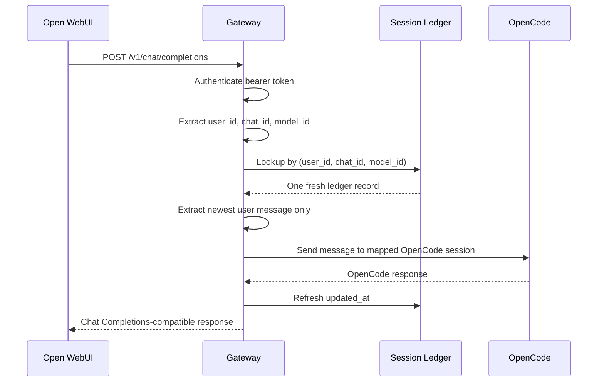
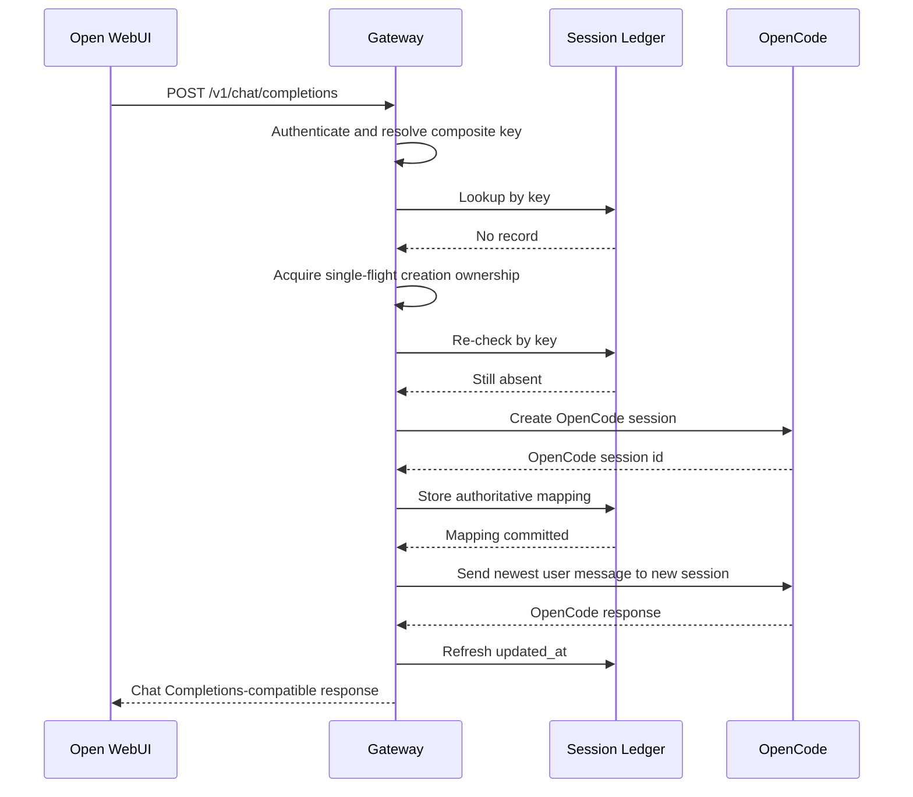
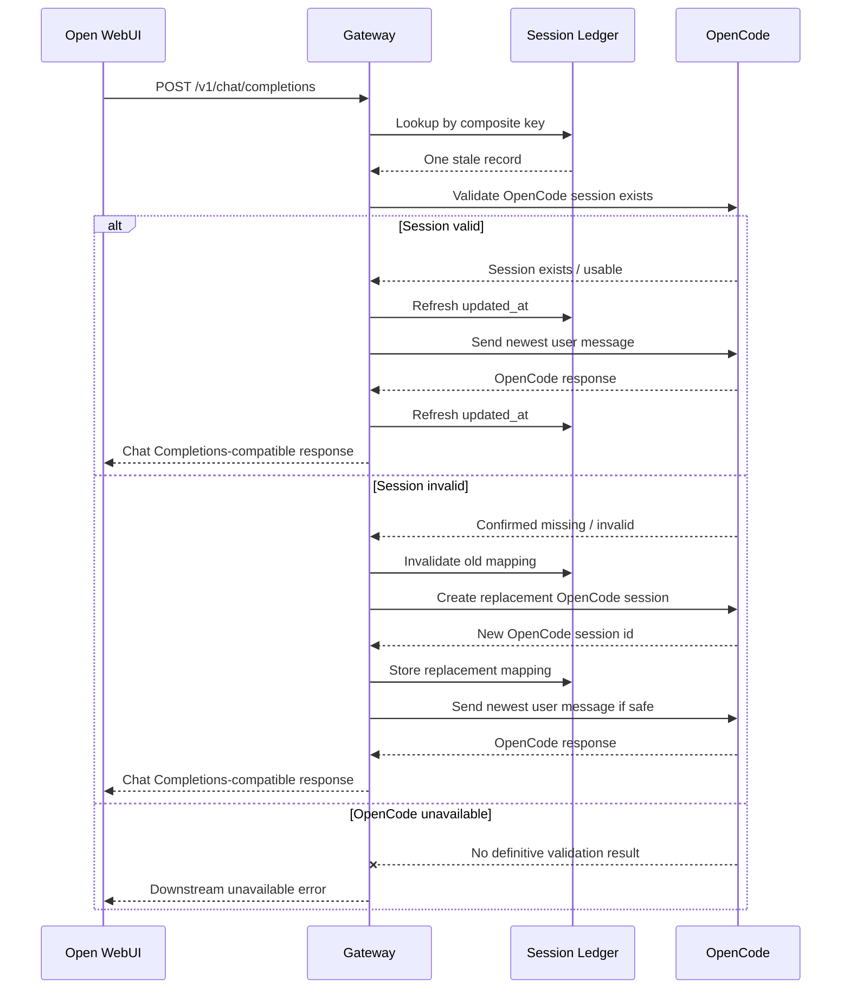
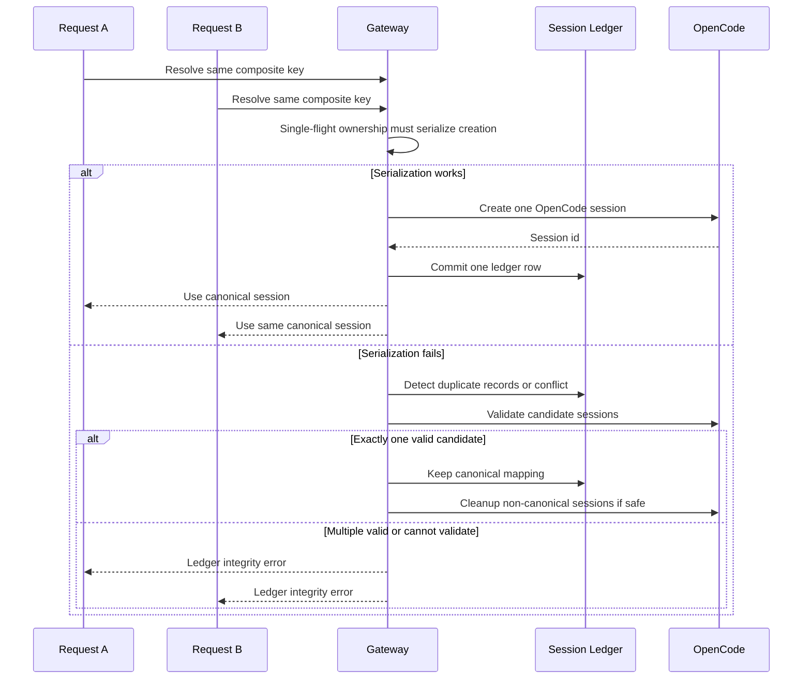

# Session Ledger Design

- **Status:** Proposed
- **Date:** 2026-06-01
- **Scope:** Gateway-owned session mapping between Open WebUI chat requests and OpenCode sessions.
- **Document path:** `docs/design/session-ledger.md`
- **Implementation code:** Out of scope.

## 1. Purpose

The Session Ledger is the gateway-owned state boundary that prevents Open WebUI's stateless Chat Completions request pattern from corrupting OpenCode's stateful session model.

Open WebUI sends a Chat Completions request that may include prior conversation history. OpenCode keeps conversation state inside an OpenCode session. Therefore, the gateway must not replay the full Open WebUI history into OpenCode on every request. The gateway must resolve the incoming Open WebUI request to one persistent OpenCode session and forward only the newest routable user turn.

The ledger exists to answer one question deterministically:

```text
For this Open WebUI user, this Open WebUI chat, and this public gateway model, which OpenCode session owns the continuation?
```

## 2. Non-goals

- Do not implement storage, migrations, repositories, locks, or API handlers.
- Do not define undocumented OpenCode request or response field schemas.
- Do not invent Open WebUI identity fields beyond the documented forwarded headers.
- Do not use `body.user` as the primary session identity unless a later verified contract explicitly allows it.
- Do not claim multi-tenant isolation from the ledger alone.
- Do not expose ledger identifiers to Open WebUI users.
- Do not treat OpenCode Basic Auth credentials as ledger data.

## 3. Source constraints

This design is constrained by the existing roadmap and discovery documents:

| Constraint | Design consequence |
|---|---|
| Open WebUI expects an OpenAI-compatible provider surface. | The ledger is internal to the gateway and must not leak OpenCode-native state into the Open WebUI contract. |
| OpenCode exposes stateful session/message endpoints. | The gateway must map Open WebUI chat identity to OpenCode session identity. |
| Open WebUI may forward `X-OpenWebUI-*` headers only when enabled. | `user_id` and `chat_id` must be taken from trusted forwarded headers; multi-tenant mode must fail closed when they are absent. |
| Phase 1 is synchronous and non-streaming. | Ledger lookup, creation, and update are defined first for `POST /v1/chat/completions` using the synchronous OpenCode message path. |
| Phase 4 includes idle-session garbage collection. | The ledger must use `updated_at` as the cleanup clock. |
| Exact OpenCode request schemas still require live `/doc` verification. | The ledger design may name required OpenCode lifecycle endpoints but must not invent request bodies. |

## 4. Ledger schema

The Session Ledger has exactly the following logical fields.

| Field | Ownership | Required | Description | External source |
|---|---|---:|---|---|
| `id` | Gateway-owned | Yes | Internal unique ledger record identifier. It is opaque and must not be exposed as an API contract. | Gateway internal state. |
| `user_id` | Open WebUI-derived | Yes | Stable user partition key. In multi-tenant mode, this must come from the trusted `X-OpenWebUI-User-Id` header. | Forwarded Open WebUI user identity header. |
| `chat_id` | Open WebUI-derived | Yes | Stable chat/session partition key. In normal ledger mode, this must come from the trusted `X-OpenWebUI-Chat-Id` header. | Forwarded Open WebUI chat identity header. |
| `model_id` | Request-derived | Yes | Public gateway model id from the Chat Completions request. It is part of the key because different model ids can map to different OpenCode agents or capability profiles. | `body.model`. |
| `opencode_session_id` | OpenCode-derived | Yes after creation | Downstream OpenCode session id returned by OpenCode session creation. | OpenCode `POST /session` response. |
| `created_at` | Gateway-owned | Yes | Time when the ledger record became the authoritative mapping for the composite key. | Gateway clock. |
| `updated_at` | Gateway-owned | Yes | Last successful use, validation, or lifecycle touch of the mapping. Used for stale detection and cleanup. | Gateway clock. |

### 4.1 Required uniqueness constraint

The logical uniqueness constraint is:

```text
unique(user_id, chat_id, model_id)
```

Without this constraint, duplicate ledger records can route a single Open WebUI chat/model pair into multiple OpenCode sessions. That is a correctness bug, not a harmless optimization problem.

### 4.2 Field invariants

| Invariant | Requirement |
|---|---|
| `id` immutability | Once assigned, `id` must never be reused for another mapping. |
| Composite key immutability | `user_id`, `chat_id`, and `model_id` must not be changed in place. A different key requires a different ledger record. |
| `opencode_session_id` immutability | Once a record is active, replacing `opencode_session_id` in place is forbidden except during explicit invalid-session recovery. The recovery must be documented as an invalidation plus replacement transition. |
| Timestamp monotonicity | `updated_at` must never move backward for the same record. |
| User partitioning | A lookup for one `user_id` must never fall back to a row belonging to another `user_id`. No wizard loopholes. |
| Model partitioning | A lookup for one `model_id` must never reuse a row for another `model_id`. |
| Header trust | `user_id` and `chat_id` are trusted only when the gateway is behind Open WebUI or another explicitly trusted upstream. They are not standalone authentication. |

## 5. Ledger key resolution

### 5.1 Required identity inputs

| Input | Source | Missing behavior |
|---|---|---|
| `user_id` | `X-OpenWebUI-User-Id` | Multi-tenant mode: reject. Single-user development mode: may use one explicit deployment-local sentinel identity, but must not claim user isolation. |
| `chat_id` | `X-OpenWebUI-Chat-Id` | Reject for normal ledger-routed chat completion because stable chat routing is impossible without it. |
| `model_id` | `body.model` | Reject because model routing and ledger partitioning are undefined without it. |

The gateway must not silently derive `user_id` or `chat_id` from arbitrary message content. That would be fake determinism. Bad magic. Burn it.

### 5.2 Composite key

```text
session_ledger_key = (user_id, chat_id, model_id)
```

The key is intentionally model-aware. One Open WebUI chat can legitimately invoke different public gateway models, such as an analysis model and an execution model. Those models may map to different OpenCode agents, permissions, and state expectations.

## 6. Lookup algorithm

This is a design algorithm, not implementation code.

1. Authenticate the Open WebUI request at the gateway boundary before ledger lookup.
2. Extract `model_id` from the request body.
3. Extract `user_id` and `chat_id` from trusted forwarded Open WebUI headers.
4. Validate that all required identity inputs are present according to the deployment mode.
5. Build the composite key `(user_id, chat_id, model_id)`.
6. Look up the ledger record by the composite key.
7. If no record exists, enter the creation flow.
8. If exactly one record exists and it is not stale, reuse its `opencode_session_id`.
9. If exactly one record exists and it is stale, enter the stale-session validation flow.
10. If more than one record exists for the key, enter the duplicate-session recovery flow.
11. Dispatch only the newest routable user message to the resolved OpenCode session.
12. Refresh `updated_at` only after the downstream session is successfully used or validated.

### 6.1 Freshness rule

A record is fresh when:

```text
current_time - updated_at <= idle_session_threshold
```

A record is stale when:

```text
current_time - updated_at > idle_session_threshold
```

The roadmap example is cleanup after more than 30 minutes of inactivity. The exact value is a deployment policy, not a wire contract.

## 7. Creation flow

### 7.1 Creation rules

Creation is triggered only when no ledger record exists for `(user_id, chat_id, model_id)`.

The creation flow must be single-flight per composite key. Multiple concurrent requests for the same key must not create multiple authoritative OpenCode sessions.

### 7.2 Creation steps

1. Acquire exclusive creation ownership for the composite key.
2. Re-check the ledger under that ownership.
3. If a record appeared while waiting, reuse it and exit creation.
4. Request a new OpenCode session through the documented OpenCode session creation endpoint.
5. Store the returned `opencode_session_id` with `created_at` and `updated_at` set from the gateway clock.
6. Commit the record as the authoritative mapping for the composite key.
7. Release creation ownership.
8. Route the newest user message to the created OpenCode session.

### 7.3 Creation failure behavior

| Failure point | Required behavior |
|---|---|
| Identity extraction fails | Reject before contacting OpenCode. Do not create a ledger row. |
| Model mapping fails | Reject before contacting OpenCode. Do not create a ledger row. |
| OpenCode unavailable before session creation | Return a gateway downstream-availability error. Do not create a ledger row. |
| OpenCode creates a session but ledger commit fails | The OpenCode session is orphaned. Do not pretend the mapping exists. Attempt cleanup only if downstream deletion behavior is verified and safe. |
| Concurrent creation conflict | Use the winning ledger row. Any extra downstream session is orphaned and must be cleanup-handled. |

## 8. Update flow

`updated_at` is the ledger's operational heartbeat.

### 8.1 Update triggers

| Trigger | Update `updated_at`? | Reason |
|---|---:|---|
| Successful OpenCode message response in non-streaming mode | Yes | The session was used successfully. |
| Successful stale-session validation | Yes | The session is known to still exist and is usable. |
| Successful session creation | Yes | Initial heartbeat. |
| Gateway validation failure before OpenCode call | No | No downstream session activity occurred. |
| OpenCode unavailable | No | The gateway does not know whether the session is usable. |
| Invalid OpenCode session response | No for old row | The old mapping is invalid and must not be refreshed. |
| Cleanup skip because session is busy | Optional policy | If verified status says the session is busy, the cleanup worker may leave `updated_at` unchanged or refresh it as a liveness touch. The chosen policy must be consistent. |

### 8.2 Update constraints

- `created_at` must not change after creation.
- `updated_at` must move forward only after a meaningful lifecycle event.
- Failed downstream calls must not refresh `updated_at`; otherwise broken sessions become immortal zombies.
- Updating `opencode_session_id` is not a normal update. It is an invalid-session replacement transition.

## 9. Cleanup flow

Cleanup is responsible for removing ledger records and optionally terminating idle OpenCode sessions.

### 9.1 Cleanup candidate rule

A record is a cleanup candidate when:

```text
current_time - updated_at > cleanup_idle_threshold
```

The cleanup threshold may equal the stale threshold or be longer. A longer cleanup threshold is safer because it gives stale-session validation a chance to recover sessions before deletion.

### 9.2 Cleanup steps

1. Select records whose `updated_at` is older than the cleanup threshold.
2. For each candidate, acquire cleanup ownership for its composite key.
3. Re-check the record after acquiring ownership.
4. If the record was updated recently, skip it.
5. Check whether the OpenCode session is currently active or busy using documented OpenCode status/session endpoints only after their runtime behavior is verified.
6. If the session is busy, skip cleanup. Do not abort active work as part of idle cleanup.
7. If the session is idle and downstream deletion is enabled, request OpenCode session deletion.
8. If OpenCode confirms deletion, remove the ledger row.
9. If OpenCode reports the session is already missing or invalid, remove the ledger row.
10. If OpenCode is unavailable or deletion fails ambiguously, keep the ledger row and retry in a later cleanup cycle.

### 9.3 Cleanup must not do these things

- Must not delete a row while an in-flight request for the same composite key is using it.
- Must not abort a busy OpenCode session unless a separate cancellation policy explicitly requests it.
- Must not delete records for all users when filtering by one user.
- Must not assume `DELETE /session/:id` semantics beyond the verified OpenCode contract.
- Must not fabricate a successful cleanup if the downstream result is unknown.

## 10. State machine

The following states are behavioral states. The required schema does not include a `state` column. A future implementation may represent these states implicitly through locks, timestamps, in-flight request tracking, and downstream validation results.

### 10.1 States

| State | Meaning |
|---|---|
| `ABSENT` | No ledger record exists for the composite key. |
| `CREATING` | The gateway is creating an OpenCode session for the composite key. |
| `ACTIVE` | Exactly one ledger record exists and is believed usable. |
| `IN_USE` | The gateway is actively routing a request through the mapped OpenCode session. |
| `STALE` | A ledger record exists, but `updated_at` is older than the stale threshold and must be validated before reuse. |
| `INVALID` | The ledger record points to an OpenCode session that is confirmed missing, rejected, or unusable. |
| `DUPLICATE` | More than one ledger record or more than one authoritative downstream session exists for the same composite key. |
| `CLEANUP_CANDIDATE` | The ledger record is idle long enough to be considered for cleanup. |
| `CLEANING` | Cleanup ownership has been acquired and cleanup is in progress. |
| `DELETED` | The ledger row no longer exists. |
| `ORPHANED` | A downstream OpenCode session exists without an authoritative ledger row. |
| `BLOCKED_DOWNSTREAM_UNAVAILABLE` | The gateway cannot safely validate, create, use, or delete because OpenCode is unavailable. |

### 10.2 Transition table

| ID | From | Trigger | Guard | Action | To |
|---|---|---|---|---|---|
| T01 | `ABSENT` | First valid request for key | Identity and model are valid | Acquire creation ownership | `CREATING` |
| T02 | `CREATING` | OpenCode session created and ledger row committed | Commit succeeds | Store `opencode_session_id`, `created_at`, `updated_at` | `ACTIVE` |
| T03 | `CREATING` | Another request created row first | Existing row found on re-check | Reuse existing row | `ACTIVE` |
| T04 | `CREATING` | OpenCode unavailable | No downstream session id returned | Return downstream-availability error; no row | `ABSENT` |
| T05 | `CREATING` | Ledger commit fails after OpenCode creation | Downstream session exists but no row committed | Mark downstream session as cleanup target if possible | `ORPHANED` |
| T06 | `ACTIVE` | Valid request for same key | Record is fresh | Use `opencode_session_id` | `IN_USE` |
| T07 | `IN_USE` | OpenCode message succeeds | Synchronous response returned | Refresh `updated_at` | `ACTIVE` |
| T08 | `IN_USE` | OpenCode unavailable or ambiguous timeout | No definitive invalid-session signal | Do not refresh row; return error | `ACTIVE` |
| T09 | `IN_USE` | OpenCode returns confirmed invalid/missing session | Invalid signal is definitive | Invalidate old mapping | `INVALID` |
| T10 | `ACTIVE` | Stale threshold exceeded | `updated_at` older than stale threshold | Require validation before reuse | `STALE` |
| T11 | `STALE` | Validation succeeds | OpenCode session exists and is usable | Refresh `updated_at` | `ACTIVE` |
| T12 | `STALE` | Validation confirms missing/invalid session | Definitive invalid signal | Invalidate old mapping | `INVALID` |
| T13 | `STALE` | OpenCode unavailable during validation | Validation cannot complete | Do not mutate row; return error | `BLOCKED_DOWNSTREAM_UNAVAILABLE` |
| T14 | `BLOCKED_DOWNSTREAM_UNAVAILABLE` | Later request or cleanup retry | OpenCode reachable again | Retry validation, creation, use, or cleanup depending on prior operation | `STALE` or `ACTIVE` |
| T15 | `INVALID` | Replacement allowed | Latest user turn has not been accepted by invalid session | Remove or supersede invalid row, then create replacement session | `CREATING` |
| T16 | `INVALID` | Replacement unsafe | Gateway cannot prove prior prompt was not accepted | Return explicit error; do not replay automatically | `INVALID` |
| T17 | `ACTIVE` | Cleanup threshold exceeded | No in-flight request for key | Acquire cleanup ownership | `CLEANUP_CANDIDATE` |
| T18 | `CLEANUP_CANDIDATE` | Cleanup begins | Ownership acquired | Validate activity/status | `CLEANING` |
| T19 | `CLEANING` | Session idle and deletion succeeds | Downstream confirms deletion | Remove ledger row | `DELETED` |
| T20 | `CLEANING` | Session already missing | Downstream confirms missing/invalid | Remove ledger row | `DELETED` |
| T21 | `CLEANING` | Session busy | Verified busy/running status | Skip cleanup; keep row | `ACTIVE` |
| T22 | `CLEANING` | OpenCode unavailable or deletion ambiguous | No definitive result | Keep row for retry | `CLEANUP_CANDIDATE` |
| T23 | `ACTIVE` | Duplicate row detected for same key | More than one authoritative row exists | Enter duplicate recovery | `DUPLICATE` |
| T24 | `DUPLICATE` | Exactly one valid downstream session remains | Validation succeeds for one candidate only | Keep valid candidate; cleanup others | `ACTIVE` |
| T25 | `DUPLICATE` | Multiple valid downstream sessions exist | More than one candidate is valid | Select canonical only by explicit recovery policy; cleanup non-canonical if safe | `ACTIVE` or `DUPLICATE` |
| T26 | `DUPLICATE` | Validation impossible | OpenCode unavailable or ambiguous | Reject request; do not route randomly | `DUPLICATE` |
| T27 | `ORPHANED` | Cleanup confirms safe deletion | Orphan session identified and idle | Delete downstream orphan if verified safe | `DELETED` |
| T28 | `ORPHANED` | Cleanup cannot verify deletion safety | Unknown downstream state | Keep orphan record in operational report; do not route to it | `ORPHANED` |

## 11. Sequence diagrams

### 11.1 Existing active session lookup



### 11.2 New session creation



### 11.3 Stale session validation and reuse



### 11.4 Cleanup of idle session

```mermaid
sequenceDiagram
    participant CW as Cleanup Worker
    participant SL as Session Ledger
    participant OC as OpenCode

    CW->>SL: Find records older than cleanup threshold
    SL-->>CW: Cleanup candidates
    loop For each candidate
        CW->>SL: Acquire cleanup ownership and re-check
        SL-->>CW: Candidate still idle
        CW->>OC: Check session status / existence
        alt Session idle
            OC-->>CW: Idle / exists
            CW->>OC: Delete OpenCode session if enabled
            OC-->>CW: Deletion confirmed
            CW->>SL: Remove ledger row
        else Session busy
            OC-->>CW: Busy
            CW->>SL: Keep row; skip cleanup
        else Session missing
            OC-->>CW: Missing / invalid
            CW->>SL: Remove ledger row
        else OpenCode unavailable
            OC--xCW: Unknown result
            CW->>SL: Keep row for later retry
        end
    end
```

### 11.5 Duplicate creation race recovery



## 12. Failure scenarios

### 12.1 OpenCode unavailable

| Context | Detection | Ledger mutation | Response behavior | State transition |
|---|---|---|---|---|
| During creation | Session creation request fails, times out, or cannot authenticate downstream. | No ledger row is created. | Return downstream-availability/authentication error. | `CREATING -> ABSENT` or `CREATING -> ORPHANED` if downstream session was created but commit failed. |
| During message send | Existing session cannot be reached or result is ambiguous. | Do not refresh `updated_at`. Keep old row. | Return downstream-availability error. Do not replay automatically. | `IN_USE -> ACTIVE` without timestamp refresh. |
| During stale validation | Validation cannot complete. | Do not delete or replace the row. | Return downstream-availability error. | `STALE -> BLOCKED_DOWNSTREAM_UNAVAILABLE`. |
| During cleanup | Status/delete cannot complete. | Keep row for retry. | Cleanup logs/metrics only; no user-facing success claim. | `CLEANING -> CLEANUP_CANDIDATE`. |

Design principle: OpenCode unavailability is not proof that a session is invalid. Treat it as unknown, not as permission to destroy or recreate state.

### 12.2 Stale session

| Condition | Required behavior |
|---|---|
| `updated_at` exceeds stale threshold | Do not blindly reuse. Validate first. |
| Validation succeeds | Refresh `updated_at`, then route the newest user message. |
| Validation confirms invalid/missing session | Invalidate old mapping and create a replacement session if safe. |
| Validation is impossible | Keep row and return downstream-availability error. |

A stale session is a suspect, not a corpse. Verify before burial.

### 12.3 Invalid session

An invalid session is confirmed only when OpenCode definitively reports that `opencode_session_id` is missing, invalid, deleted, inaccessible, or unusable. A timeout is not an invalid-session signal.

| Situation | Required behavior |
|---|---|
| Invalid detected before prompt submission | Replace the mapping and send the latest user message to the new session. |
| Invalid detected during message send before acceptance is guaranteed | Replace and retry at most once if the gateway can prove the prompt was not accepted. |
| Invalid detected after ambiguous timeout | Do not retry automatically. Return error because duplicate prompt execution is possible. |
| Invalid detected by cleanup | Remove ledger row; no user request is being routed. |

### 12.4 Duplicate session

Duplicate sessions can appear in two forms:

1. **Duplicate ledger rows:** multiple rows share the same `(user_id, chat_id, model_id)`.
2. **Duplicate downstream sessions:** multiple OpenCode sessions were created for one key, but only one ledger row became authoritative.

| Duplicate type | Required behavior |
|---|---|
| Duplicate ledger rows | Treat as a ledger integrity failure. Do not randomly choose a row. |
| Exactly one valid downstream candidate | Keep that candidate as canonical and cleanup non-canonical rows/sessions if safe. |
| Multiple valid downstream candidates | Use deterministic recovery only if a policy is explicitly defined. Otherwise reject with ledger integrity error. |
| Cannot validate candidates | Reject with ledger integrity error and preserve data for manual/operator recovery. |
| Orphaned non-canonical OpenCode session | Do not route to it. Cleanup later if safe and verified. |

Recommended canonical-selection policy when automatic recovery is explicitly allowed:

1. Prefer the row with the newest `updated_at` if exactly one candidate is valid and all others are invalid.
2. If multiple candidates are valid, prefer no automatic recovery unless active-work detection proves the non-canonical sessions are idle.
3. Tie-break by lowest `id` only for rows that point to the same `opencode_session_id`.

## 13. Concurrency model

The ledger must be safe under concurrent Open WebUI requests.

| Hazard | Required design control |
|---|---|
| Two first requests for same key | Single-flight creation ownership by composite key. |
| Cleanup races with message send | Cleanup ownership must conflict with in-flight request ownership for the same key. |
| Stale validation races with cleanup | Only one lifecycle owner may mutate a row at a time. |
| Duplicate insert race | Composite uniqueness must reject duplicates; recovery must not route randomly. |
| Downstream session created but ledger commit fails | Treat downstream session as orphaned; never infer mapping from OpenCode session list alone. |

## 14. Error classification

Exact JSON error fields are intentionally not defined here because the Open WebUI and OpenCode field-level error contracts require verification. The gateway must still classify errors consistently.

| Error class | Cause | Retryable by user? | Ledger effect |
|---|---|---:|---|
| `missing_route_identity` | Missing required `user_id`, `chat_id`, or `model_id`. | No, configuration/request must be fixed. | None. |
| `unsupported_model` | `model_id` has no gateway mapping. | No, model mapping must be fixed. | None. |
| `downstream_unavailable` | OpenCode unreachable or timed out. | Yes. | Do not mutate except orphan tracking if needed. |
| `downstream_auth_failed` | Gateway credentials rejected by OpenCode. | No, operator must fix credentials. | Do not mutate. |
| `stale_session_unverified` | Stale record exists but OpenCode cannot validate it. | Yes. | Keep row unchanged. |
| `invalid_session` | OpenCode definitively rejects the mapped session. | Usually yes after replacement. | Invalidate old row; create replacement only when safe. |
| `duplicate_session` | Multiple ledger/downstream candidates for one key. | No, operator or recovery policy required. | Do not route randomly. |
| `cleanup_deferred` | Cleanup cannot prove safe deletion. | Not user-facing. | Keep row. |

## 15. Observability requirements

This design does not implement metrics, but the ledger must be observable in production.

Required telemetry concepts:

| Signal | Purpose |
|---|---|
| Lookup count by outcome: hit, miss, stale, duplicate | Shows routing behavior and ledger health. |
| Session creation count by outcome | Detects OpenCode availability and creation races. |
| Invalid-session count | Detects downstream session churn or cleanup bugs. |
| Duplicate-session count | Detects correctness failures immediately. |
| Cleanup candidate/deleted/deferred counts | Validates garbage collection behavior. |
| Age distribution from `updated_at` | Reveals zombie sessions and cleanup lag. |
| Correlation id across Open WebUI request, ledger row, and OpenCode session id | Debugs misrouting without leaking secrets. |

Never log OpenCode credentials. Avoid logging full user prompts as ledger diagnostics.

## 16. Security and isolation notes

| Concern | Design rule |
|---|---|
| User isolation | Partition by `user_id`. If `user_id` is unavailable, do not claim multi-user isolation. |
| Header spoofing | Trust forwarded user/chat headers only from a controlled Open WebUI-to-gateway network boundary. |
| Model capability separation | Include `model_id` in the key to avoid mixing read-only and write-capable agent sessions. |
| Cross-user leakage | A lookup must never fall back across users, even during recovery. |
| Orphan sessions | Orphans must not become routable merely because they exist in OpenCode. |
| Cleanup deletion | Cleanup must not delete busy sessions or sessions owned by another user/model key. |

## 17. Acceptance criteria check

| Criterion | Status |
|---|---|
| Schema includes `id` | Satisfied. |
| Schema includes `user_id` | Satisfied. |
| Schema includes `chat_id` | Satisfied. |
| Schema includes `model_id` | Satisfied. |
| Schema includes `opencode_session_id` | Satisfied. |
| Schema includes `created_at` | Satisfied. |
| Schema includes `updated_at` | Satisfied. |
| Lookup algorithm defined | Satisfied. |
| Creation flow defined | Satisfied. |
| Update flow defined | Satisfied. |
| Cleanup flow defined | Satisfied. |
| Sequence diagrams provided | Satisfied. |
| State transitions documented | Satisfied in the transition table. |
| OpenCode unavailable failure mode covered | Satisfied. |
| Stale session failure mode covered | Satisfied. |
| Invalid session failure mode covered | Satisfied. |
| Duplicate session failure mode covered | Satisfied. |
| No production code generated | Satisfied. |
| No undocumented OpenCode schema invented | Satisfied. |
