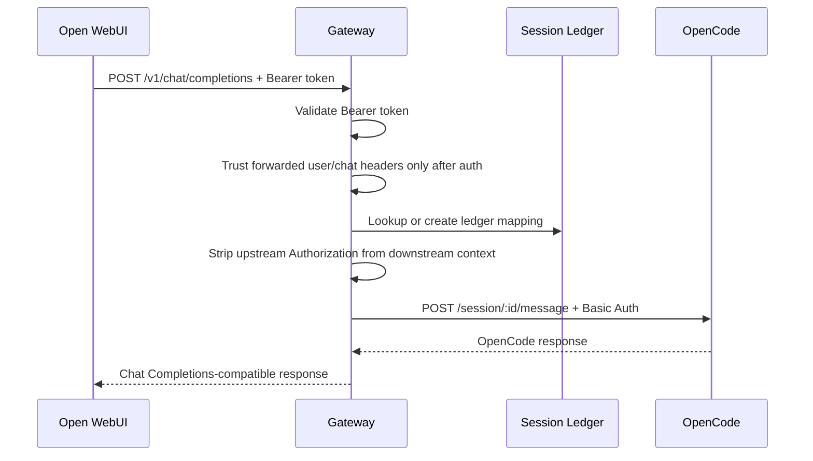
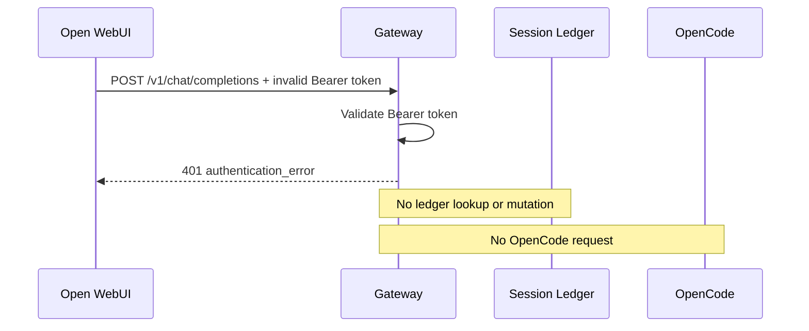
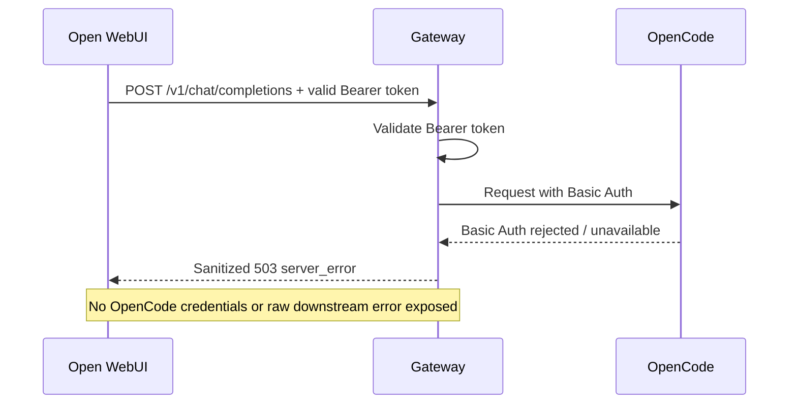

# Authentication Design

- **Document:** `docs/security/authentication.md`
- **Status:** Proposed
- **Date:** 2026-06-01
- **Owner role:** Security Engineer
- **Scope:** Authentication, secret handling, trust boundaries, and authentication threat model for the OpenCode Gateway.
- **Implementation code:** Out of scope.

## 1. Source policy

This design is derived from the roadmap and discovery/design artifacts for the OpenCode Gateway:

| Input | Used for |
|---|---|
| `roadmap.txt` | Authentication tiers, container topology, phase-1 requirements, and secret exposure constraints. |
| `docs/discovery/openwebui-contract.md` | Open WebUI provider configuration, Bearer-token verification, and forwarded user/session headers. |
| `docs/discovery/opencode-api-audit.md` | OpenCode server authentication behavior and documented Basic Auth configuration. |
| `docs/discovery/gateway-gap-analysis.md` | Security gaps, required two-tier authentication, and multi-user identity caveats. |
| `docs/adr/001-gateway-architecture.md` | Authentication boundaries, header trust, and error-boundary decisions. |
| `docs/design/openai-compatibility-layer.md` | Endpoint-level authentication rules and shared error behavior. |
| `docs/design/session-ledger.md` | User/session header trust, tenant partitioning, and logging restrictions. |

This document intentionally does **not** introduce OIDC, SSO, enterprise identity providers, mTLS, OAuth, authorization servers, browser sessions, or a new identity protocol. Those are outside the current project contract. No wizard fog.

## 2. Security goals

1. Authenticate Open WebUI before the gateway performs model listing, session lookup, session creation, or message forwarding.
2. Keep the Open WebUI-facing Bearer token separate from OpenCode Basic Auth credentials.
3. Prevent OpenCode Basic Auth credentials from reaching Open WebUI, browser clients, chat payloads, logs, metrics, traces, or model-visible context.
4. Treat forwarded `X-OpenWebUI-*` headers as routing metadata only, never as proof of authentication.
5. Store secrets through environment variables for MVP and Docker secrets where the deployment supports file-mounted secrets.
6. Fail closed on missing, malformed, duplicate, or invalid credentials.
7. Avoid exposing raw downstream errors that may contain credentials, filesystem paths, internal hostnames, command output, or stack traces.

## 3. Non-goals

- No OIDC design.
- No SSO design.
- No RBAC policy engine.
- No per-user enterprise authorization service.
- No password login flow in the gateway.
- No browser cookie/session management in the gateway.
- No custom signed-request protocol.
- No raw OpenCode API exposure to Open WebUI.
- No secrets in source control, documentation examples, fixtures, tests, logs, or screenshots.

## 4. Authentication model summary

The gateway uses two separate authentication boundaries:

```text
Browser/User  --->  Open WebUI  --->  Gateway  --->  OpenCode server
                 outside scope      Bearer auth     Basic Auth
```

| Boundary | Authentication | Secret owner | Gateway responsibility |
|---|---|---|---|
| Browser/user → Open WebUI | Outside this design | Open WebUI | Do not assume anything except that Open WebUI is the trusted upstream once it reaches the gateway boundary. |
| Open WebUI → Gateway | Static Bearer token | Gateway operator; token configured into Open WebUI provider connection | Validate before any downstream call or ledger mutation. |
| Gateway → OpenCode | HTTP Basic Auth | Gateway operator / OpenCode operator | Use internal credentials only when calling OpenCode. Never expose upstream. |
| Forwarded Open WebUI headers | Not authentication | Open WebUI | Use only as trusted routing/audit metadata after Bearer validation and only across a controlled network boundary. |
| Logs/metrics/traces | Not authentication | Gateway operator | Redact credentials and avoid full prompt/header logging. |

## 5. Trust boundaries

### 5.1 Boundary A: Open WebUI provider connection to Gateway

Open WebUI calls the gateway as an OpenAI-compatible provider. The gateway must require `Authorization: Bearer <gateway-api-key>` for:

| Endpoint | Authentication decision |
|---|---|
| `GET /v1/models` | Required. Open WebUI provider verification uses the model-listing endpoint. |
| `POST /v1/chat/completions` | Required. No session lookup or OpenCode call before validation. |
| `GET /health` | Required unless the endpoint is bound only to a trusted internal network. Public/shared-network health must require Bearer auth. |

The Bearer token proves only that the caller knows the gateway provider secret. It does **not** identify an end user. End-user identity, when available, comes from trusted forwarded Open WebUI headers after the provider request has already been authenticated.

### 5.2 Boundary B: Gateway to Session Ledger

The Session Ledger is internal gateway state. Authentication must complete before the gateway reads or mutates the ledger.

| Rule | Requirement |
|---|---|
| Missing/invalid Bearer token | Do not read or write the ledger. |
| Missing `X-OpenWebUI-User-Id` in multi-tenant mode | Reject; do not silently route as another user. |
| Missing `X-OpenWebUI-Chat-Id` in normal ledger mode | Reject; stable chat routing is impossible. |
| Forwarded headers | Trust only when received from Open WebUI across a controlled network boundary. |
| Cross-user fallback | Forbidden. One user's lookup must never fall back to another user's ledger row. |

### 5.3 Boundary C: Gateway to OpenCode

OpenCode is the execution engine and has a higher blast radius than the gateway's provider surface. The gateway must authenticate to OpenCode using Basic Auth when OpenCode is protected by `OPENCODE_SERVER_PASSWORD`.

| Rule | Requirement |
|---|---|
| Direct Open WebUI → OpenCode calls | Forbidden as the target architecture. It bypasses gateway policy, session mapping, and credential isolation. |
| Upstream Bearer forwarding to OpenCode | Forbidden. The gateway must strip/ignore the upstream `Authorization` header before creating the downstream Basic Auth header. |
| OpenCode Basic credentials in upstream responses | Forbidden. Never include username, password, encoded Basic header, or credential source path. |
| OpenCode public exposure | Forbidden for production. Keep OpenCode on an internal Docker/network segment or bind host exposure to loopback for local development only. |

### 5.4 Boundary D: Observability systems

Logs, metrics, traces, error reports, and debug dumps are a separate trust boundary. Treat them as potentially accessible to operators and incident tooling.

| Data | Logging rule |
|---|---|
| `Authorization` headers | Always redact. |
| Bearer token | Never log raw. |
| Basic Auth username/password | Never log raw. |
| Docker secret file paths | Avoid logging except sanitized config-source labels. |
| Full user prompts | Avoid by default; log hashes/correlation IDs instead. |
| OpenCode errors | Sanitize before surfacing or logging at high visibility. |
| OpenCode filesystem paths and shell output | Redact or downgrade unless explicitly classified safe for operator logs. |

## 6. Client → Gateway Bearer token validation

### 6.1 Required header

```text
Authorization: Bearer <gateway-api-key>
```

The token is the static API key configured in the Open WebUI provider connection.

### 6.2 Validation algorithm

This is a design algorithm, not implementation code.

1. Receive request.
2. If the endpoint requires authentication, read the `Authorization` header.
3. Reject if the header is missing.
4. Reject if multiple `Authorization` headers are present or the header is ambiguous after proxy normalization.
5. Reject if the scheme is not `Bearer`.
6. Reject if the token value is empty, contains control characters, or fails basic header-value validation.
7. Compare the presented token with the configured gateway token using constant-time comparison.
8. Reject invalid credentials before request-body parsing that could trigger expensive downstream work.
9. On success, create an internal authenticated-request context.
10. Continue to model mapping, ledger lookup, or downstream OpenCode calls only after authentication succeeds.

### 6.3 Failure behavior

| Condition | Status | Error type | Required behavior |
|---|---:|---|---|
| Missing `Authorization` | `401` | `authentication_error` | Do not call OpenCode. Do not touch ledger. |
| Wrong scheme | `401` | `authentication_error` | Do not call OpenCode. Do not touch ledger. |
| Empty token | `401` | `authentication_error` | Do not call OpenCode. Do not touch ledger. |
| Invalid token | `401` | `authentication_error` | Do not call OpenCode. Do not touch ledger. |
| Duplicate/ambiguous auth headers | `401` or `400` | `authentication_error` or `invalid_request_error` | Fail closed. Do not pick one. |

The response must not reveal whether the configured token exists, how long it is, how close the submitted token was, or where the token is stored.

### 6.4 Bearer token rules

| Rule | Requirement |
|---|---|
| Token entropy | Use a high-entropy random value. Recommended operational policy: at least 256 bits of randomness. |
| Token transport | Use only the `Authorization` header. Do not accept query-string tokens. |
| Token storage | Environment variable or Docker secret. Never hardcode. |
| Token comparison | Constant-time comparison. |
| Token reuse downstream | Forbidden. The upstream Bearer token must never be forwarded to OpenCode. |
| Token in logs | Forbidden. Redact before logging request headers. |
| Token in errors | Forbidden. Do not echo submitted credentials. |
| Token in prompts | Forbidden. Do not place token values into model-visible content. |
| Rotation | Supported operationally by changing the configured gateway secret and updating Open WebUI's provider API key. |

### 6.5 Forwarded user headers are not auth

Open WebUI may forward headers such as:

| Header | Gateway use |
|---|---|
| `X-OpenWebUI-User-Id` | Session partition key and audit metadata. |
| `X-OpenWebUI-Chat-Id` | Session Ledger chat key. |
| `X-OpenWebUI-Message-Id` | Optional correlation/message metadata after schema verification. |
| `X-OpenWebUI-User-Role` | Future policy input only if explicitly designed; not authentication proof. |
| `X-OpenWebUI-User-Email` | Audit metadata only; avoid logging by default. |

These headers are trusted only when:

1. Bearer validation succeeds; and
2. the gateway is reachable only from Open WebUI or another explicitly trusted upstream proxy.

If the gateway is exposed directly to users, these headers are spoofable. Treat direct public exposure as a security bug unless a separate trusted ingress strips and re-injects the headers.

## 7. Gateway → OpenCode Basic authentication

### 7.1 Required behavior

The gateway authenticates to OpenCode using HTTP Basic Auth when OpenCode is protected by `OPENCODE_SERVER_PASSWORD`.

| Item | Requirement |
|---|---|
| Username | Read from secret/config, or use OpenCode's documented default only by explicit deployment policy. Recommended: configure explicitly. |
| Password | Read from secret/config. Required for any non-throwaway deployment. |
| Header construction | Construct only for the outbound OpenCode request. |
| Header exposure | Never expose upstream, never store in ledger, never include in model context. |
| Downstream auth failure | Normalize into a sanitized gateway error. Do not pass raw downstream challenge details if they reveal internals. |

### 7.2 Downstream request rules

| Rule | Requirement |
|---|---|
| Separate HTTP client context | Keep OpenCode request construction separate from upstream request handling. |
| Header allowlist | Send only required downstream headers. Do not blindly proxy all upstream headers. |
| Authorization overwrite | Downstream `Authorization` must be Basic Auth, never the upstream Bearer token. |
| Credential lifetime | Keep credentials in process memory only as long as required by runtime configuration. |
| Network scope | Use an internal Docker network, private service DNS, or loopback binding. Do not publish OpenCode to the public internet. |
| Error sanitization | Do not expose Basic Auth username/password, encoded header, internal URL, stack traces, or raw shell output. |

### 7.3 Basic Auth failure behavior

| Condition | Gateway classification | Required behavior |
|---|---|---|
| Missing configured OpenCode password | `downstream_auth_failed` or startup configuration failure | Prefer fail-fast at startup. If discovered at request time, return sanitized `503`. |
| OpenCode rejects Basic Auth | `downstream_auth_failed` | Return sanitized `503`; operator must fix credentials. |
| OpenCode unreachable | `downstream_unavailable` | Return sanitized `503`/`504`; do not mutate ledger as if success occurred. |
| OpenCode auth challenge shape unknown | `downstream_auth_failed` with `UNKNOWN` downstream schema | Do not invent downstream error details. |

## 8. Secret storage design

### 8.1 Secret inventory

| Secret/config | Required | Secret? | Storage source | Used by |
|---|---:|---:|---|---|
| `GATEWAY_API_KEY` | Yes | Yes | Environment variable or Docker secret | Validating Open WebUI → Gateway Bearer token. |
| `OPENCODE_BASE_URL` | Yes | No, but internal | Environment variable/config | Locating OpenCode on internal network. |
| `OPENCODE_SERVER_USERNAME` | Yes by policy | Usually low sensitivity, still avoid public logs | Environment variable or Docker secret | Building OpenCode Basic Auth. |
| `OPENCODE_SERVER_PASSWORD` | Yes | Yes | Environment variable or Docker secret | Building OpenCode Basic Auth. |
| `ENABLE_FORWARD_USER_INFO_HEADERS` | Open WebUI-side setting | No | Open WebUI environment | Enables user/session metadata forwarding. |

Do not store OpenCode credentials in the Session Ledger. The ledger stores `user_id`, `chat_id`, `model_id`, `opencode_session_id`, timestamps, and internal identifiers only.

### 8.2 Environment variable mode

Environment variables are acceptable for local development and MVP deployment.

Required rules:

| Rule | Requirement |
|---|---|
| `.env` handling | `.env` files must be ignored by Git and excluded from generated artifacts. |
| Startup validation | Gateway must fail startup or readiness if required secrets are missing. |
| Printing config | Never print raw secret values during startup. |
| Debug endpoints | Must not expose environment values. |
| Process dumps | Treat as sensitive. Operators must know env vars are visible to process-level introspection on the host. |

### 8.3 Docker secrets mode

Docker secrets are preferred when the deployment environment supports file-mounted secrets.

Recommended design contract:

| Direct env var | Docker secret file variant | Precedence |
|---|---|---|
| `GATEWAY_API_KEY` | `GATEWAY_API_KEY_FILE` | File variant should take precedence when both are set. |
| `OPENCODE_SERVER_USERNAME` | `OPENCODE_SERVER_USERNAME_FILE` | File variant should take precedence when both are set. |
| `OPENCODE_SERVER_PASSWORD` | `OPENCODE_SERVER_PASSWORD_FILE` | File variant should take precedence when both are set. |

Docker secret rules:

1. Mount secret files read-only.
2. Restrict file permissions to the gateway process user where possible.
3. Do not log the file contents.
4. Avoid logging absolute secret file paths in high-visibility logs.
5. Reloading changed secrets requires either a documented restart or an explicit future hot-reload design. Do not pretend hot reload exists unless implemented later.

### 8.4 Secret rotation

| Secret | Rotation behavior |
|---|---|
| Gateway Bearer token | Generate a new token, update gateway secret, update Open WebUI provider API key, restart/reload as required. During rotation, requests using the old token should fail after cutover. |
| OpenCode Basic password | Generate a new OpenCode password, update OpenCode server secret, update gateway secret, restart/reload both sides in a controlled order. |
| OpenCode username | Rotate only with the password or when moving away from defaults. |

This design does not define dual-token grace periods. A grace period would increase operational convenience but also extends the replay window. Default is single active secret per boundary.

## 9. Authentication request flows

### 9.1 Successful non-streaming chat request



### 9.2 Invalid upstream Bearer token



### 9.3 Downstream Basic Auth failure



## 10. Threat model

### 10.1 Assets

| Asset | Why it matters |
|---|---|
| Gateway Bearer token | Allows access to the OpenAI-compatible gateway surface from Open WebUI. |
| OpenCode Basic Auth credentials | Allow direct access to OpenCode's stateful execution API. Higher blast radius. |
| Session Ledger keys | Can route a user/chat/model to an OpenCode session; corruption risks cross-session leakage. |
| Forwarded user/session headers | Used for partitioning and audit; spoofing can cause misrouting if boundary is exposed. |
| Logs/traces/metrics | Often replicated to external systems and can accidentally preserve secrets forever. |
| OpenCode workspace | May contain source code, generated patches, command output, and project files. |

### 10.2 Threat: token leakage

| Field | Design |
|---|---|
| Threat | The Open WebUI → Gateway Bearer token leaks through logs, copied config, browser screenshots, proxy traces, `.env` files, shell history, or accidental commits. |
| Impact | An attacker can call `GET /v1/models` and `POST /v1/chat/completions` as a trusted provider client. If execution models are exposed, this can become workspace modification through OpenCode. |
| Required controls | High-entropy token; header-only token transport; no query-string token support; no raw token logs; `.env` ignored; redaction in request logging; internal network exposure; rotate on suspected leakage. |
| Detection | Count authentication failures, unusual model usage, unexpected source IP/container, spikes in session creation, and requests without expected Open WebUI forwarded headers. |
| Residual risk | A static Bearer token is replayable until rotated. This is the honest cost of the MVP auth model. |

### 10.3 Threat: credential leakage

| Field | Design |
|---|---|
| Threat | OpenCode Basic Auth username/password leaks from environment variables, Docker inspect output, debug logs, crash dumps, shell history, generated support bundles, or raw error propagation. |
| Impact | An attacker may bypass the gateway and call OpenCode directly if the OpenCode network surface is reachable. This bypasses model mapping, session ledger controls, request validation, and upstream audit semantics. |
| Required controls | Keep OpenCode on a private Docker network or loopback binding; use Docker secrets where applicable; never expose Basic credentials upstream; never print encoded Basic headers; use different secrets for gateway and OpenCode; sanitize downstream errors. |
| Detection | Monitor direct OpenCode requests, failed Basic Auth attempts, unexpected source addresses, and OpenCode session creation outside gateway correlation IDs. |
| Residual risk | If OpenCode is published on a reachable network and Basic credentials leak, the gateway is bypassed. Do not publish OpenCode publicly. Full stop. |

### 10.4 Threat: replay attacks

| Field | Design |
|---|---|
| Threat | An attacker captures a valid Bearer token or Basic Auth header and reuses it. |
| Impact | Replayed Bearer token allows gateway access; replayed Basic Auth allows direct OpenCode access if the network path is reachable. |
| Required controls | Use TLS or private container networking; prevent token capture; avoid logs containing headers; rotate secrets; keep OpenCode internal; enforce request timeouts; consider rate limiting as an operational hardening control. |
| Not implemented by this design | Nonces, request signatures, token introspection, OIDC, OAuth, mTLS. They are outside the current scope. |
| Residual risk | Stateless Bearer and Basic Auth are replayable by design. The practical defense is preventing capture and limiting where captured credentials can be used. |

### 10.5 Threat: log exposure

| Field | Design |
|---|---|
| Threat | Secrets or sensitive context are written into application logs, reverse proxy logs, tracing spans, model-visible prompts, exception reports, or debugging artifacts. |
| Impact | Long-lived secret compromise, sensitive project leakage, cross-user privacy issues, and impossible cleanup after logs replicate. |
| Required controls | Redact `Authorization`; redact `Cookie` if ever present; redact secret-like env values; avoid full prompt logging; log correlation IDs instead of raw content; sanitize OpenCode errors; block debug endpoints from returning config. |
| Detection | Secret-scanning in logs/artifacts; alert on raw `Bearer`, `Basic`, `OPENCODE_SERVER_PASSWORD`, `GATEWAY_API_KEY`, and base64-looking Basic headers. |
| Residual risk | Operator debug mode is dangerous. If debug logging is enabled, it must still run through redaction. Debug mode is not a license to dump headers. |

### 10.6 Threat: forwarded-header spoofing

| Field | Design |
|---|---|
| Threat | A caller reaches the gateway directly and sends forged `X-OpenWebUI-User-Id` or `X-OpenWebUI-Chat-Id` headers. |
| Impact | Session Ledger misrouting, cross-user session access, wrong audit attribution, and possible workspace leakage in future multi-tenant mode. |
| Required controls | Do not expose the gateway directly to arbitrary clients; trust forwarded headers only from Open WebUI/private ingress; reject multi-tenant requests without expected headers; optionally strip/re-inject headers at a trusted proxy in future deployment. |
| Residual risk | Header-based identity is not authentication. It is safe only behind a trusted boundary. |

## 11. Authorization and capability notes

Authentication answers: “May this caller use the gateway?” It does not answer: “Which OpenCode agent capabilities are safe?”

Capability separation is handled by gateway-owned model mapping and OpenCode agent configuration:

| Public gateway model profile | Auth implication | Capability implication |
|---|---|---|
| Analysis profile | Same Bearer token gate | Should map to read-oriented OpenCode agent configuration. |
| Execution profile | Same Bearer token gate | Should map to write-capable OpenCode agent configuration with destructive operations ask/deny in OpenCode configuration. |

Do not expose all raw OpenCode agents automatically. Authentication does not make unsafe agents safe. That would be security theater wearing a wizard hat.

## 12. Endpoint-level authentication matrix

| Endpoint | Bearer required | Calls OpenCode? | Downstream auth | Notes |
|---|---:|---:|---|---|
| `GET /health` | Yes unless internal-only | Yes, if readiness checks downstream | Basic Auth when configured | Must not expose credentials or raw downstream failures. |
| `GET /v1/models` | Yes | Optional/yes, if validating against `GET /agent` | Basic Auth when calling OpenCode | Do not expose raw unsafe agents. |
| `POST /v1/chat/completions` | Yes | Yes | Basic Auth | Auth first, ledger second, OpenCode third. |

## 13. Error handling and sanitization

| Error source | Required response behavior |
|---|---|
| Missing/invalid gateway Bearer token | Return `401 authentication_error`; no OpenCode call; no ledger mutation. |
| Missing/malformed request after auth | Return `400 invalid_request_error`; no OpenCode call if validation fails before routing. |
| Unknown model after auth | Return `404 model_not_found`; no arbitrary OpenCode agent fallback. |
| OpenCode Basic Auth failure | Return sanitized `503 server_error` or equivalent gateway-owned error. |
| OpenCode unavailable | Return sanitized `503` or `504`; do not pretend success. |
| OpenCode error body contains sensitive data | Redact before upstream response and high-visibility logs. |
| Unknown downstream error schema | Preserve safe category/status only; do not invent detailed semantics. |

## 14. Operational hardening requirements

These controls are compatible with the current auth model and do not require OIDC or enterprise auth.

| Control | Requirement |
|---|---|
| Network isolation | Run Open WebUI, Gateway, and OpenCode on an internal Docker network. Expose only Open WebUI to users for local/demo topology. |
| OpenCode binding | Prefer no host port for OpenCode. If needed for local debugging, bind to `127.0.0.1`, not `0.0.0.0`. |
| Gateway exposure | Expose Gateway only to Open WebUI or a trusted private ingress. |
| Secret scanning | Scan repo, generated docs, logs, and artifacts for `Bearer`, `Basic`, `GATEWAY_API_KEY`, and `OPENCODE_SERVER_PASSWORD`. |
| Startup checks | Fail if required secrets are missing. Warn/fail if OpenCode is reachable without expected Basic Auth in non-local mode. |
| Correlation IDs | Use request/session correlation IDs that do not encode secrets or full prompts. |
| Rate limiting | Recommended as operational hardening against brute force/replay abuse, but not a substitute for authentication. |
| Timeouts | Required for downstream OpenCode calls to avoid auth-valid requests hanging indefinitely. |

## 15. Validation checklist

Before implementation is accepted, verify:

| Check | Expected result |
|---|---|
| `GET /v1/models` without Bearer | `401`; no OpenCode call. |
| `GET /v1/models` with wrong Bearer | `401`; no OpenCode call. |
| `GET /v1/models` with valid Bearer | Model response or sanitized downstream error. |
| `POST /v1/chat/completions` without Bearer | `401`; no ledger lookup; no OpenCode call. |
| `POST /v1/chat/completions` with valid Bearer but missing OpenCode credentials | Sanitized downstream auth/config error; no secret in response. |
| Gateway logs for authenticated request | No raw Bearer token, no Basic Auth header, no OpenCode password. |
| Downstream request headers | Contains Basic Auth only for OpenCode; upstream Bearer not forwarded. |
| Direct OpenCode access from outside Docker/private network | Not reachable in production topology. |
| Multi-tenant request without trusted user header | Reject or explicitly run single-user mode; never claim isolation. |
| Docker secret mode | Secret values read from files; file contents never logged. |

## 16. Acceptance criteria check

| Criterion | Status |
|---|---|
| Client → Gateway Bearer token validation defined | Satisfied. |
| Gateway → OpenCode Basic authentication defined | Satisfied. |
| Environment-variable secret storage defined | Satisfied. |
| Docker secrets support defined where applicable | Satisfied. |
| Token leakage threat modeled | Satisfied. |
| Credential leakage threat modeled | Satisfied. |
| Replay attacks threat modeled | Satisfied. |
| Log exposure threat modeled | Satisfied. |
| Trust boundaries documented | Satisfied. |
| No secrets exposed | Satisfied; placeholders and variable names only. |
| No enterprise auth invented | Satisfied. |
| No OIDC invented | Satisfied. |
